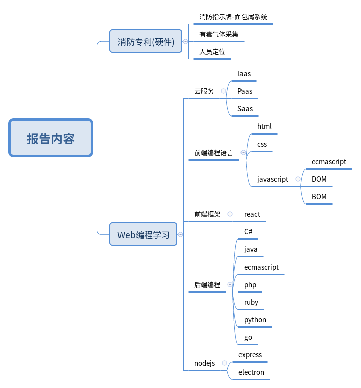
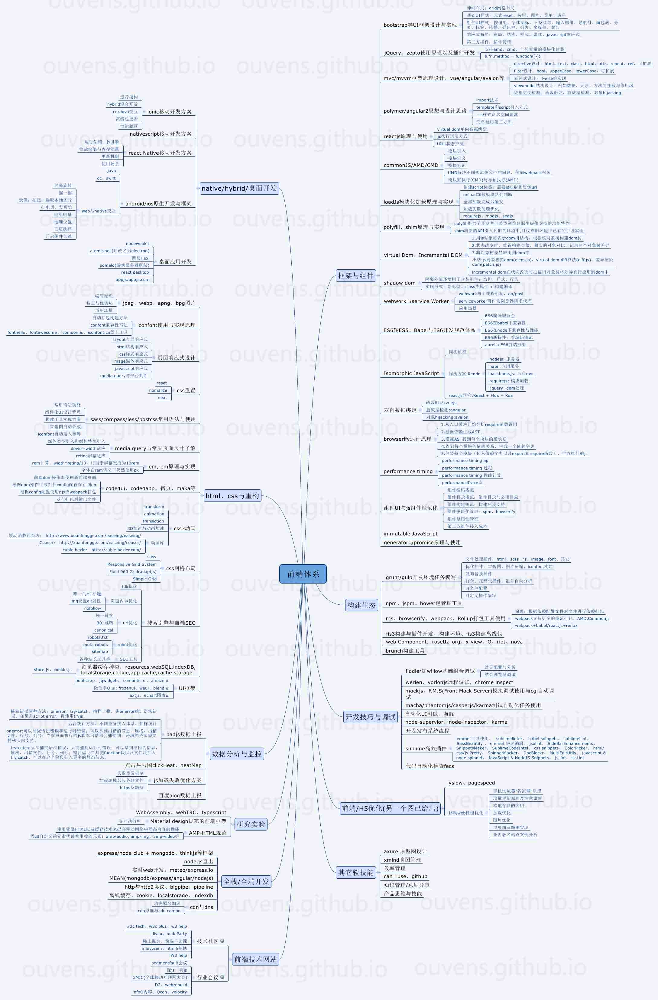

# 组会报告

#### 报告人 丰华彬

#### 报告日期 2017年5月31日

## 报告内容

---

## 3种云服务提供方式

- ### Iaas(Infrastructure as a service)  

- ### Paas(Platform as a service)

- ### Saas(Software as a service)

#### Iaas提供裸机，Paas提供OS、基础软件，Saas提供软件服务(金蝶办公软件)；

#### 传统应用软件需要用户提供Platform，Web软件就是Saas；

---

## Web开发所涉及的技能树

## 前端开发的3中语言

- ### html
- ### css
- ### javascript

#### `html+css` 实现了界面制作的标准化；

#### `javascript` 的优点：

- ##### 顽强的生命力；eg. ecmascript6 可以通过 babel.js 转换为 ecmascript5 实现浏览器兼容；

- #### 库超多；Node.js 项目的 npm 是世界上最大的包管理器，登记了超过 35 万软件包，其中主要是js代码；

- #### 开源项目超多；在github上超过一半的项目是js；

## react

facebook开源的前端框架，有自己的JSX语法，最终被编译为javascript代码；

利用react-native可以实现一套代码，同时在ios、android、web端同时提供服务；

## 后端开发

- ### IIS + C#
- ### apach + php
- ### tomcat + java
- ### nodejs + javascript
- ### 其他，如go、ruby、python；

经常使用的数据库：SqlServer，oracle，mysql，mongo等；

## nodejs

#### nodejs是一个为javascript的本地开发而准备的库，其包含库有：

- ##### 文件系统操作库
- ##### 网络操作库(tcp/ip/dns/http/https)
- ##### 系统调用库

## npm

一个用于管理工程模块的库；通过package.json文件，指定该过程所依赖的库极其版本号；可以自动从npm上下载相应版本的库到本地；

还可以进行编程工具的下载(npm install，和apt-get install相似)；

## express

对nodejs进行封装后的Web开发框架；

## electron

对nodejs进行封装后的本地应用开发库(windows/linux/mac os)；
