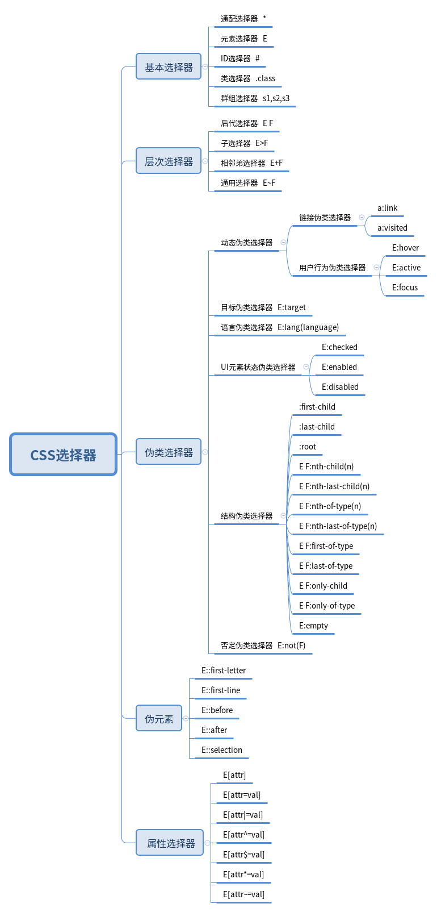
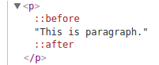

## CSS选择器结构逻辑图



接下来按照结构逻辑图具体讲解各个选择器的作用及用法；

## 基本选择器

基本选择器主要有以下5类：

1. `* ` : 通配选择器；匹配html中的所有Html元素；

2. `E ` : 元素选择器；选中html中指定的某一类Html元素，如 h1 将选中所有的“h1”元素；

3. `#id ` : ID选择器；选中html中id属性为特定值的所有元素；

4. `.class ` : 类选择器；选中html中class属性为特定值的所有元素；

5. `s1,s2,s3 ` : 组群选择器；对多个选择器进行组合，同时定义相同的css样式，定义组群选择器主要是为了减少代码的冗余；

## 层次选择器(相对选择器)

层次选择器通过Html的DOM元素间的层次关系选择元素；我也喜欢把层次选择器称为相对选择器，就是找一个html元素作为基准，寻找相对于它的后代、孩子、兄弟等元素；

1. `E F ` : 后代选择器；选中所有E容器所包含的类型为F的后代元素；

2. `E>F ` : 子选择器；选择所有E容器中所有类型为F的子元素；

注意：”E的子元素F“是指F的父元素就是E，而”E的后代元素“是指F的父元素可能是E，或者F的父元素的父元素是E，或者F的父元素的父元素的父元素是E，... ；因此，"子"是"后代"的一个子集；

3. `E+F ` : 相邻弟选择器；看了很多的教材都说这是相邻兄弟选择器，但是，它只能选择紧靠E的，之后的F元素，而紧靠E的，之前的F元素不被选择，所以，窃以为相邻弟选择器更加贴切，虽然不太学术；

4. `E~F ` : 同辈弟选择器；学术叫法是“通用选择器”，实际上只能选择与E具有相同父元素的、位于E之后的、符合F条件的所有元素；“同辈”即指与E具有相同父元素，“弟”即指位于E之后；eg.
```html
<head>
  <style media="screen">
    #p2~p{color:red;}
  </style>
</head>
<body>
  <p id="p0">This paragraph 0</p>
  <article id="div1">
    <p id="p1">This is paragraph 1</p>
    <p id="p2">This is paragraph 2</p>
    <p id="p3">This is paragraph 3</p> <!--选中-->
    <p id="p4">This is paragraph 4</p> <!--选中-->
    <div>
      <p id="p5">This is paragraph 5</p>
    </div>
    <p id="p6">This is paragraph 6</p> <!--选中-->
  </article>
  <p id="p7">This is paragraph 7</p>
</body>
```
只有id为p3、p4、p6的元素颜色变为红色；

## 伪类选择器

伪类选择器语法书写时，与其他的CSS选择器写法有所区别，其格式为：

`E:pseudo-class{property:value;}`

其中，E为html元素，pseudo-class是CSS的伪类选择器名称；即 *伪类一定是依附于某个具体的元素的* ；伪类可以分为以下6类：

### 动态伪类选择器

动态伪类体现了用户和网站的交互状态，动态伪类又分为两类：

1. 链接伪类：因为只有a (anchor) 元素才具有的伪类，所以也称为锚点伪类；

`a:link ` : 定义链接未被访问时的样式；

`a:visited `: 定义链接被访问后的样式；

*浏览器如何判断锚点a是否访问过？*

答：经过在chrome上的测试，如果一个页面的两个a指向同一个url，那么如果点击其中一个a，另一个a也将变为visited状态，说明浏览器是通过检测缓存来统一设置a的颜色的；

*“ a#id:link ” 和 “ a:link#id是否等效 ” ？*

答：等效，对于选择器的摆放顺序没有特殊要求，只是元素选择器必须放在第一个；

*为什么有时候设置 a:link 的样式会无效*

答：a的状态设置需要遵循 *爱恨原则* ，即LoVe,HAte；即对锚的4个状态的样式定义需要按照先定义a:link，再定义a:visited，再定义a:hover，最后定义a:active的顺序进行；否则可能样式不能生效；

2. 用户行为伪类

之所以不把这几种状态的伪类归入锚点伪类，是因为这几个伪类不仅仅针对a元素；

`E:hover :` 当鼠标移动到某个元素上时，该元素所显示的样式，适用于所有元素；

`E:active :` 当某个元素被激活时，所显示的样式，通常表现为a元素或按钮元素被点击时；

`E:focus :` 当某个元素获得焦点时所显示的样式，适用于所有元素；

### 目标伪类选择器

`E:target :`选择匹配E的所有元素，且匹配元素被相关URL指向；

要了解“目标伪类选择器”，首先要了解url的组成结构：
```
<protocol>://<user>:<password>@<host>:<port>/<path>;<param>?<query>#<fragment>
```

protocol表示使用的传输协议，如htttp、ftp、smtp等；

有些url需要用户名和密码才能登陆，如ftp，则可以在url中直接指定user:password，如果没有指定用户名与密码，将在浏览器端弹出用户名-密码输入对话框；

host可以通过域名指定，也可以通过一个ip地址直接指定；

port表示提供服务的端口号，如http服务通常开80端口，ftp服务通常开21端口；

path表示服务器上资源的路径；

param用于指定特殊参数的可选项；

query：当表单以Get方式提交给服务器时，表单元素的键值对将被放在query中；

fragment：通常是html中的元素的id号，当一个html文件非常长时，通过直接指定frag，可以让浏览器定位到对应id的元素上，并显示在浏览器视口中；

当我们通过指定fragment进行页面访问时，该fragment对应的元素就是目标伪类选择器选中的元素；eg.有以下代码：
```html
<!--该文件的url为http://localhost/test.html-->
<head>
  <style type="text/css">
    #div1,#div2,#div3{height: 800;}
    #div1,#div3{background-color: red;}
    #div2{background-color: black;}
    #div2:target{
      background-color: green;
    }
  </style>
</head>
<body>
  <div id="div1"></div>
  <div id="div2"></div>
  <div id="div3"></div>
</body>
```
则以`http://localhost/test.html`访问该页面时，div2的背景是黑色，而以`http://localhost/test.html#div2`访问该页面时，页面自动定位到div2上，并且div2的背景变为绿色；

### 语言伪类选择器

`E:lang(language) : ` 当某个元素指定了lang属性时，所需要显示的样式，eg. ：
```html
<html>
<head>
    <style type="text/css">
      :lang(zh){
        background: yellow;
      }
      :lang(en){
        background: green;
      }
      div{height: 100px;}
    </style>
</head>
<body>
  <div id="div1" lang="en"></div>
  <div id="div2"></div>
  <div id="div3" lang="zh"></div>
</body>
</html>
```
div1的背景色为绿色，div2的背景色为白色，div3的背景色为黄色；

### UI元素状态伪类选择器

UI元素状态伪类选择器主要作用于form表单元素上，以提高网页的人机交互、操作逻辑以及页面的整体美观，使表单页面更具有个性与品味；

`E:checked : ` 选中状态伪类选择器；匹配选中的复选按钮(checkbox) 或 单选按钮(radio)；

`E:enabled : ` 启用状态伪类选择器；匹配所有启用的元素；

`E:disabled : ` 禁用状态伪类选择器；匹配所有禁用的元素；

### 结构伪类选择器

`:first-child ：` 选择第一个元素;

注意：`E:first-child` 和 `E :first-child`的效果是不同的，`E:first-child`是指E在某个容器中是第一个元素，则采用指定的样式，这里的容器包括body、div等等；`E :first-child`是指容器E中的第一个元素，无论其什么类型，采用指定的样式；

`:last-child : ` 选择最后一个元素;同理，`E:last-child` 和 `E :last-child`也是不同的；

`:root : ` 因为在html文档中，所有元素的根元素都是html，所以以下两句是等价的
```html
<style type="text/css">
  html{color:red;}
  :root{color:red;}
</style>
```

`E F:nth-child(n) : ` 选中所有容器E中，从第一个元素开始数，序号为n的F元素；并且n可以是一个常数或者是an+b类型的数(其中a、b为常数，n从0开始计数)，还可以是even或odd，even表示偶数，等价于2n，odd表示奇数，等价于2n+1；还是举个具体的栗子吧：
```html
<head>
    <style type="text/css">
      div h1:nth-child(3n+1){
        color:red;
      }
    </style>
</head>
<body>
  <div>
    <h1 id="h_1">This is h_1</h1> <!--第1个元素-->
    <h1 id="h_2">This is h_2</h1> <!--第2个元素-->
    <h1 id="h_3">This is h_3</h1> <!--第3个元素-->
    <h2 id="h_4">不是h1</h2>    <!--第4个元素-->
    <h1 id="h_5">This is h_5</h1> <!--第5个元素-->
    <h1 id="h_6">This is h_6</h1> <!--第6个元素-->
    <h1 id="h_7">This is h_7</h1> <!--第7个元素-->
    <h1 id="h_8">This is h_8</h1> <!--第8个元素-->
    <h1 id="h_9">This is h_9</h1> <!--第9个元素-->
  </div>
</body>
```
上述代码将会使在容器div中的、类型为h1的、序号为3n+1的元素被选中，所以id为h_1、h_7两个元素选中，h_4因为不是h1元素而不被选，如果选择器为`div :nth-child(3n+1)`，则h_4也将被选中；

`:nth-last-child : ` 与nth-child相似，只是元素序号从后往前数，若将上述代码中的nth-child改为nth-last-child，则倒数第1、4、7个元素，即id为h_9、h_6、h_3的元素被选中；

`E F:nth-of-type(n) : ` nth-of-type与nth-child非常类似，只是只将类型为F的元素纳入计序，而不是把所有E的子元素都进行计序；还是以上述代码为栗子，若将nth-child改为nth-of-type,则id为h_1、h_5、h_8元素将被选中，因为它们分别是第0×3+1、1×3+1、2×3+1个h1元素；

`E F:nth-last-of-type(n) : ` 与nth-of-type类似，只是从后往前对E元素进行计数；

`E F:first-of-type : `等价于 `E F:nth-of-type(1)` ；

`E F:last-of-type : ` 等价于 `E F:nth-last-of-type(1)` ；

`E F:only-child : ` 当容器E只有一个子元素F时，F被选中；

`E F:only-of-type : ` 当容器E中，没有与F类型相同的元素时，即F的元素类型在容器E中惟一，F被选中；

`E:empty : ` 当E元素没有任何内容(包括空格也没有)时所使用的样式；

### 否定伪类选择器

`:not() : ` 起到过滤的效果，过滤掉具有某些属性的元素，举个栗子：

```html
<head>
    <style type="text/css">
      div h1:not(:nth-child(odd)){
        color:red;
      }
    </style>
</head>
<body>
  <div>
    <h1 id="h_1">This is h_1</h1> <!--第1个元素-->
    <h1 id="h_2">This is h_2</h1> <!--第2个元素-->
    <h1 id="h_3">This is h_3</h1> <!--第3个元素-->
    <h2 id="h_4">不是h1</h2>    <!--第4个元素-->
  </div>
</body>
```
该代码将会选中在div中，序号为非奇数的h1元素，则只有id为h_2的元素被选中；

##伪元素

伪元素主要用于定位文档中的文本，而不是html元素；也是因为它们在html中没有对应的元素，所以被称为伪元素；

需要说明的是，伪元素并不是在CSS3中才出现的，比如

“:first-line”、":first-letter"、":before"、":after"

CSS3为了区分伪元素和伪类，对伪元素进行了规范化，将单冒号变为了双冒号，即变为了

"::first-line"、"::first-letter"、"::before"、"::after"

另外，伪元素增加了一个"::selection"；浏览器为了兼容，如果伪元素前使用单冒号也能被解析为伪元素；

`::first-letter : ` 用于定位元素文档中的第一个字母；eg.
```html
<style type="text/css">
  h1::first-letter{
    background-color: grey;
    color: blue;
  }
</style>
```
上述代码将会使html中所有的h1元素第一个字符变为灰底蓝字；

`::first-line : ` 用于定位元素文档中的第一行；eg.
```html
<head>
    <style type="text/css">
      h1::first-line{
        background-color: grey;
        color: deepskyblue;
      }
    </style>
</head>
<body>
    <h1 id="h_1">line1<br>line2</h1>
</body>
```

上述代码中,"line1"和"line2"以换行&lt;br&gt; 换行分隔；在浏览器中，"line1"为灰底蓝字，而"line2"为正常显示；

`::before : ` 在某元素的前面添加内容；

`::after : ` 在某元素的后面添加内容；
eg.

```html
<head>
    <style type="text/css">
      p::before{content:"Before.";}
      p::after{content: "After.";}
    </style>
</head>
<body>
  <p>This is paragraph.</p>
</body>
```

将在页面中显示：

```
Before.This is paragraph.After.
```
查看页面源码如下：



可见，伪元素`::before`和`::after`被添加到p *内部* 的前面和后面，并且内容与设置的content相同；

设置伪元素时，必须设置器content属性，否则伪元素将无效；

content属性可以有以下内容：

- `字符串`: 作为伪元素的内容添加到主元素中；若字符串中有html代码，这些代码以文本形式显示，而不会转化为真正的html内容显示；

- `attr(attr_name)` : 伪元素的某个内容跟主元素的某个属性进行关联；

- `url()` : 引入外部资源；eg.

```html
<style>
  p::before{content:url("./x.png")}
</style>
```
将在p中引入图片显示在最前面；

- `counter()` : 调用计数器，可以不使用列表元素实现序号问题；

`::selection ` : 用来匹配突出显示的文本，该伪元素仅接受两个属性--background和color；eg.

```html
<head>
    <style type="text/css">
      p::selection{
        background: yellow;
        color:red;
      }
    </style>
</head>
<body>
  <p>This is paragraph.</p>
</body>
```

则在页面中通过鼠标选中p的某些文本，这些文本将会以黄底红字显示；

## 属性选择器

`E[attr] ` : 选择含有属性attr的所有元素，E可以省略；attr不能加引号；

`E[attr=val] ` : 选择属性attr为val的所有E元素；val不区分大小写

`E[attr|=val] ` : 选择属性attr为val或以 val- 开始的E元素；

`E[attr^=val] ` : 选择属性attr为val或以 val 开始的E元素；

`E[attr$=val] ` ： 选择属性attr为val或以val结尾的E元素；

`E[attr*=val] ` : 属性attr的任意位置有val值的所有E元素；

`E[attr~=val] ` : 属性attr中以空格分割为多个值后，其中有val的所有E元素；

## 选择器的优先级

多个选择器可能选中了同一个对象，那哪个选择器定义的样式真正起作用，这就需要定义选择器的优先级；

在某个属性后面添加!important,将会强制使用该处的属性覆盖其他地方的属性，eg.

```html
<head>
    <style type="text/css">
      div :first-child{color:red !important;}
    </style>
</head>
<body>
  <div>
    <p style="color:green;">This is paragraph.</p>
  </div>
</body>
```
其中的p元素字体为红色，而不是内联样式指定的绿色；

结果chrome测试，选择器的优先级为：

1. 有!important的属性

1. 内联样式

1. id选择器

1. 类选择器

1. 层次选择器

1. 伪类选择器

1. 属性选择器

1. 元素选择器

1. 通配选择器

对于同一优先级的选择器，当它们选中同一元素，并对该元素的同一个属性进行定义而产生冲突时，后定义的样式将覆盖前定义的样式；

PS (PostScript) : 参考很多前人的文章，没有一一列出，敬请谅解；主要参考书籍为大漠老师的《图解CSS3--核心技术与案例实战》。有写的不好的地方或者错误的地方欢迎指正，感谢！
