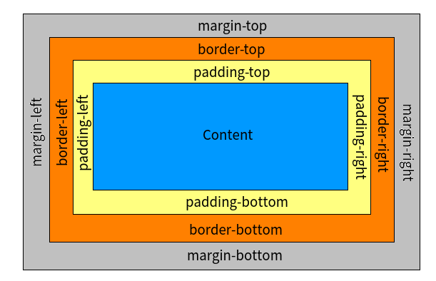

## CSS之属性逻辑结构图


该图显示了CSS的属性，好了，下面就一个个具体讲解；

## 了解CSS的盒子模型

在CSS中，每个元素都被看做一个盒子模型，而这种盒子模型在二维上看就是一个矩形，如下图所示：



通常来说，我们指定width、height属性就是指定Content部分的宽度和长度，实际上我们可以通过设置box-sizing来定义长与宽所代表的内容；

box-sizing 是CSS3新引入的样式，其有如下可选值：

- `content-box ` ： 默认属性，定义width、height指代Content的宽、高(上图内1层蓝色的部分)；
- `padding-box ` ：定义width、height指代上图内2层黄色和蓝色部分的宽和高；
- `border-box ` : 定义width、height指代上图内3层的宽和高；

## 边框

这里所说的边框主要指margin、border和padding三块围绕Content的部分；

### margin

margin包括4个部分：margin-top、margin-right、margin-bottom和margin-left，是指与其他元素之间的距离；margin可以对4个方向进行统一设置，也可以对其中的方向分别设置：

```html
<style type="text/css">
  /*margin后面所跟的参数个数可以是1、2、3或4*/

  /*1：设置div 4个方向的margin(留白)都为20px；*/
  div{margin:20px;}
  /*2：设置div上下的margin为20px,左右的margin为10px*/
  div{margin:20px 10px;}
  /*3：设置div的上-右-下-左margin分别为30px,20px,10px,20px*/
  div{margin:30px 20px 10px;}
  /*4：设置div的上-右-下-左margin分别为40,30px,20px,10px*/
  div{margin:40px 30px 20px 10px;}

  /*也可以通过margin-XXX指定XXX方向的margin*/
  div{margin-top: 20px;}

</style>
```

需要注意的是，两个元素的margin是不会相加,只会叠加，举个栗子，eg.

```html
<style>
  div{width: 60px; height: 50px;}
  #div1{background-color: yellow;}
  #div2{background-color: orange;}
</style>
<body>
  <div id="div1" style="margin-bottom:20px;"></div>
  <div id="div2" style="margin-top:10px;"></div>
</body>
```
上述代码中，div1和div2之间的留白并不是`20px+10px=30px`，而是`max{20px,10px}=20px`；

margin的参数值还可以是：

- `% ` : 规定基于父元素的 **宽度** 的百分比的外边距；比如父元素style为 `width:400px;height:200px;` , 那么竖直方向上`margin-top:%50`等价于`margin-top:200px`，而不是`margin-top:100px`；

- `auto ` : auto作用于水平方向而不是竖直方向；代码`margin:auto`，设置所有方向的margin为auto，浏览器将计算父元素和本元素的宽度，计算左右留白，计算公为：`左(右)margin = (父元素宽度-本元素宽度)/2` ;


*默认情况下，margin的值被设置为 0 ；*

*margin部分的背景色使用父元素的background-color ；*

### border

border即为元素的矩形边框；border最重要的3个属性为：

- `border-width ` : 指定border的宽度，可以有的参数可以是1个、2个、3个或4个，与margin的4种不同参数的情况相同；参数类型可以是数值，如`10px`，也可以是`thin`(细)、`medium`(中等)、`thick`(粗)或`inherit`(继承)；

- `border-style ` :边框线的样式，其取值如下：

| 值 | 描述 |
| - |- |
|none	|定义无边框|
|hidden|与none相同,对于表，hidden 用于解决边框冲突|
|dotted|定义点状边框|
|dashed|定义虚线|
|solid|定义实线|
|double|定义双线|
|groove|定义3D凹槽边框|
|ridge|定义3D 垄状边框|
|inset|定义3D inset 边框|
|outset|定义3D outset 边框|
|inherit|规定应该从父元素继承边框样式|

- `border-color ` : 定义边框颜色；

这3个属性可以单独定义，也可以通过border属性同时定义，eg：
```
border : 3px solid red;
```
其中，3个参数的顺序没有要求；

- `border-radius ` : 设置border矩形4个角的圆角半径；

- `border-image` : 有时候，如果突发奇想，想为某个元素添加花圈，该属性就能派上用场了；

### padding

设置content与border之间的距离；该部分使用background-color进行颜色填充；

### box-shadow

设置边框的阴影，使其更有立体感；具体设置见 [CSS3 box-shadow介绍](http://www.jianshu.com/p/1303b96661b9);

## 背景

背景的内容有两种，一种是通过颜色进行填充，另一种是以图片进行填充；

- `background-color ` : 设置背景以指定的颜色进行填充；

- `background-image ` : 设置背景以指定的图片进行填充；

### 背景填充类型

当通过 `background-image` 指定以图片进行背景填充后，当图片尺寸小于元素尺寸导致图片不能覆盖整个元素时，可通过 `background-repeat` 设置图片的填充方式；该属性的值选项如下：

- `repeat ` : 默认，背景图片在垂直和水平方向上重复；

- `repeat-x ` : 背景图片只在水平方向上重复；

- `repeat-y ` : 背景图片只在垂直方向上重复；

- `no-repeat ` : 背景图片仅显示一次，不重复显示；

- `inherit ` : 从父元素继承该属性；

### 背景是否固定

`background-attachment` 可以是指背景是否随滚动条的移动而移动；属性如下：

- `scroll ` : 默认值，背景图片会随着页面其他部分一起移动；
- `fixed ` : 当页面的其余部分滚动时，背景图片不会移动；
- `inherit ` : 从父元素继承该属性；

### 设置背景图片开始绘制的位置

通过设置 `background-position`可以设置从什么地方开始绘制背景图片；

其选项有以下几种类型：

- `x% y% ` : 设元素的宽度为e_width，高度为e_height；设图片的宽度img_width，高度为img_height，则`x% y%` 表示图片(img_width × x% , img_height × y%)的坐标点 与 元素中的 (e_width × x% , e_height × y%)的点重合；

注意:在计算机上，左上角点设为(0,0)点，x轴水平向右，y轴垂直向下；

故：`0% 0%`表示图片左上角点与元素的左上角点重合，`100% 100%`表示图片右下角点与元素的右下角点重合，`50% 50%`表示图片中心点与元素中心重合；

如果background-repeat为no-repeat时，因为只是绘制一张图片，上述论述非常容易理解；如果背景图片以repeat方式填充，可以理解为在完成上述一张图片的绘制后，以该图片为基准位置，进行重复填充；

- 通过 left/center/right 和 top/center/bottom 的组合设置位置

|组合类型|对应`%x %y`形式|
|-|-|
|left top|0% 0%|
|left center|0% 50%|
|left bottom|0% 100%|
|center top|50% 0%|
|center center|50% 50%|
|center bottom|50% 100%|
|right top|100% 0%|
|right center|100% 50%|
|right bottom|100% 100%|

- 通过数值指定

例如，`30px 20px` 表示图片的左上角点位于元素(30px,20px)的坐标位置，换言之，从元素的(30px,20px)位置开始绘制图片；

### 确定元素的(0,0)点

设置`background-position`，我们说`left top`是指将图片的左上角点与元素的左上角点相重合，图片的左上角点容易确定，但哪里是元素的左上角点呢，这就需要通过下面的这个属性来确定了：

### background-origin

该属性可以取以下的几种值：
- `content-box ` : content 部分的左上角点设为元素(0,0)点；
- `padding-box ` : padding部分的左上角点设为元素(0,0)点；
- `border-box` : border部分的左上角点设为元素(0,0)点；

您应该觉得挺眼熟，对的，`box-sizing` 的属性也是这3个值；

### background-clip

该属性规定了填充到哪里终止，有以下3个属性：

- `content-box` : 只保留在content内的填充；
- `padding-box` : 保留content和padding内的填充；
- `border-box` : 保留content、padding、border的填充，注意，如果border-style是solid类型，则看不出结果，因为即使在border区域内填充，也会被border覆盖掉，可以通过设置border-style位dotted查看效果；

## 文本CSS设置

### 文本格式

`text-transform ` : 该属性能够控制文本的大小写，而不论源文档中文本的大小写；该属性能取以下值：

- `none ` : 不改变源文档中文本的大小写；
- `capitalize ` : 文本中的每个单词以大写字母开头；
- `uppercase ` : 文本中的所有字母变为大写；
- `lowercase ` : 文本中的所有字母变为小写；
- `inherit ` : 该属性从父元素继承；

### 字体控制

- `font-size ` : 取求值如下

|值|含义|
|-|-|
|xx-small|非常小|
|x-small|小|
|small|较小|
|medium|中等，与父元素字体尺寸相同|
|large|较大|
|x-large|大|
|xx-large|非常大|
|smaller|比父元素更小|
|larger|比父元素更大|
|length|指定字体为具体的尺寸，如20px|
|%|设置基于父元素尺寸的一个百分比<br>100%等价于medium|
|inherit|从父元素继承该属性|

- `font-weight ` : 定义字体加粗的程度，其取值如下：

|值|含义|
|-|-|
|normal|正常显示，如果h1使用该属性值，将不加粗|
|bold|粗体显示|
|bolder|更粗的字体显示|
|lighter|更细的字体显示|
|数值|由细到粗为100、200、300、...、900|
|inherit|从父元素继承|

- `font-variant` : 设置是否将文本转为小型大写字母显示，其可取的值如下：

|值|含义|
|-|-|
|normal|默认值，标准字体显示|
|small-cap|小型大写字母显示|
|inherit|从父元素继承该属性|

- `font-family` : 定义字体类型；

- `text-decoration` : 定义文本修饰，其可取的值为：

|值|含义|
|-|-|
|none|默认值，正常显示|
|underline|文字加下划线|
|line-through|文字中间加横线(类似删除线)|
|overline|文字加上划线|
|blink|文本闪烁|
|inherit|从父元素继承该属性|

- `color ` : 定义文本颜色

### 文本布局
