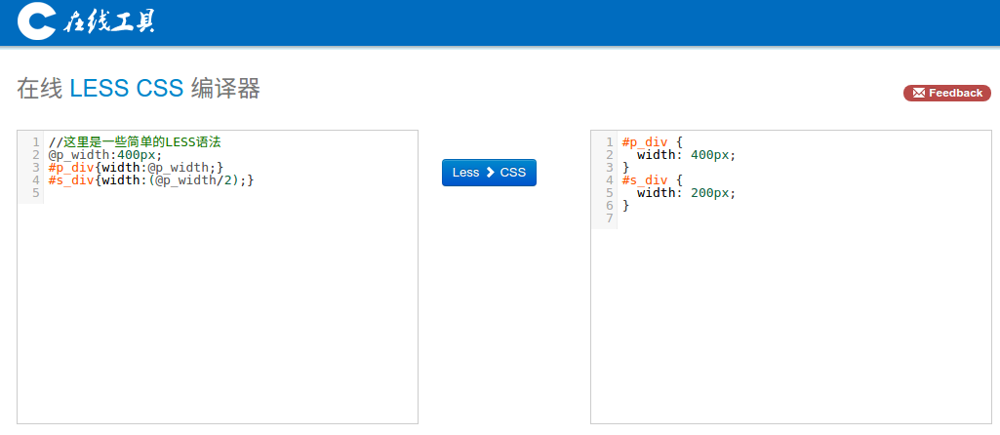

# 什么是less

less是CSS的预处理器，学过C语言的同学应该对预处理器挺熟悉的把，C语言的编译过程就分为：`预处理 -> 编译 -> 汇编 -> 连接` 这几个过程；其中C语言的预编译包括导入头文件、对宏定义进行宏替换等动作；

例如，在C语言中有如下代码：

```c
//我们在代码中需要使用一个常数8
....
int x = 8; //第一处用到
...
int y = 8;  //第二处用到
...
int z = 8;  //第三处用到
```

此时，如果想修改这个常数为7,我们需要把每一处都找出并进行替换，如果更多位置用到该常数，修改它所花费的代价将会更高。我们可以通过宏定义解决该问题：

```c
#define CONST_VALUE 8
...
int x = CONST_VALUE;
...
int y = CONST_VALUE;
...
int z = CONST_VALUE;
```

此时，如果想修改常数值的话，只需要修改第一行就ok了，大大减轻了工作量；

另外，需要说明的是，上面的这种写法还不是最优的，写成 `const int const_value = 8 ;`更好，因为这样可以进行类型检查。好吧，就此打住，毕竟这不是介绍C语言的blog，只是抛砖引玉而已，可不能把砖抛太远。

而css预处理语言，无论是sass还是less，和c语言预处理目的一致，都是为了减轻工作量而已，但是，大家一定要清楚下面一句话：

**工具能够帮助我们提高生产效率，但并不能帮助我们减少需要学习的知识，相反的，为了掌握某个工具的使用，我们甚至要学更多的知识。 所以，学习终归是没有捷径可走的。**

那么，为什么有时候，原生css编写代码效率较低，下面再举一个例子吧。

比如，我们需要写两层div的嵌套，子div宽度是父div宽度的一半，已知父div为400px ：

```css
/*父div的样式*/
#p_div{
  width:400px;
}
/*子div的样式*/
#s_div{
  width:200px;
}
```
用浏览器测试了一下，发现不太美观，想把父div改为500px进行测试，我们需要找到这两处，然后进行修改，和上面的C语言的例子非常类似，操作较为麻烦；

你也许会想，如果定义一个变量，相关属性都基于该变量进行操作，如果想改变这些属性的值，只需要改一个变量，那该有多好。好吧，我想，less应该可以满足你。

# less的使用

less是一种css的预处理语言，最终，浏览器只认识css样式，而不认识less语言，所以我们需要工具将用less编写的样式转换成css样式；

less编写的样式文件通常以`.less`为后缀；

## 1、基于node.js库的less编译工具

其实，你不需要懂什么是基于node.js库，只需要知道，通过它安装的 *lessc* 就是一个可执行文件而已；

安装方式：

```
npm install -g less
```
稍微解释一下这条命令是什么意思，npm是node package manager的缩写，可以通过它安装在npmjs.com上托管的软件，-g表示全局安装；

完成安装后，就可以在命令行使用 `lessc` 命令了；

还是以上面嵌套div作为例子，编写demo.less文件，其代码为：

```css
@p_width:400px;

#p_div{
  width: @p_width;
}
#s_div{
  width:(@p_width/2);
}

```

使用命令

```
lessc demo.less demo.css
```

将less代码编译为css样式，编译后生成的demo.css包含样式代码为：

```css
#p_div {
  width: 400px;
}
#s_div {
  width: 200px;
}
```

和我们上面手写的代码一模一样；如果想把`#p_div`的宽度变为500px，只需要修改demo.less的第一行，重新用 *lessc* 进行编译即可；

## 2、浏览器引入lesscss.js文件

前面我们说过，浏览器是不懂less语法的，所以，不能直接使用 `*.less` 文件作为页面样式；但是，浏览器不懂，我们可以 *“教他”* 懂；

例如，通过以下代码：

```html
<script src="//cdnjs.cloudflare.com/ajax/libs/less.js/2.7.2/less.min.js">
</script>
```

我们将解析less的js代码库引入，这样，就能直接在html中使用less语法了；例如：

```html
<link rel="stylesheet/less" href="demo.less" />
```

直接引入一个less文件，或者是：

```html
<style type="text/less">
  /*编写less代码 */
</style>
```

直接在html文件中编写less代码。

## 3、在线完成less转换css

还可以通过某些在线工具实现less到css的转换，例如 通过开源中国社区的 [在线工具](http://tool.oschina.net/less) 完成转换，并将转换后的代码复制到自己的css文件中即可；



## 4、其他一些图形化(GUI)编译工具

如koala、Codekit、WinLess、SimpleLess；

# 后记

本文并没有详细写less语法，只是说明了less为什么而存在，只有我们知道了事物存在的意义，才能从它来的方向，去真正地理解它；


参考 [less中文网](http://www.1024i.com/demo/less/) ;
